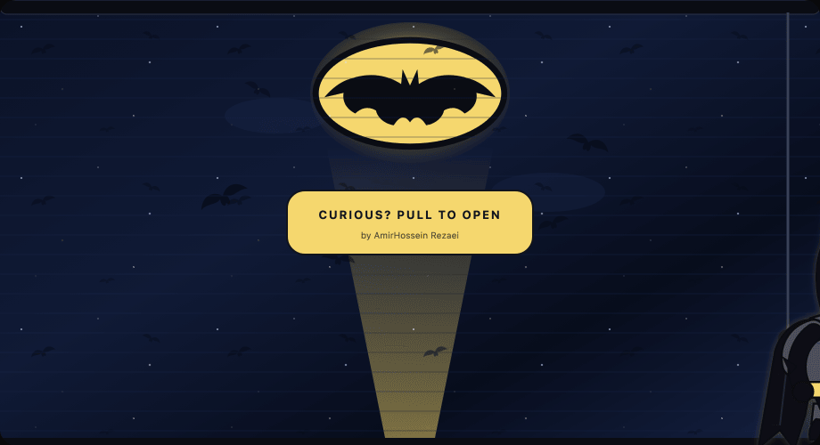
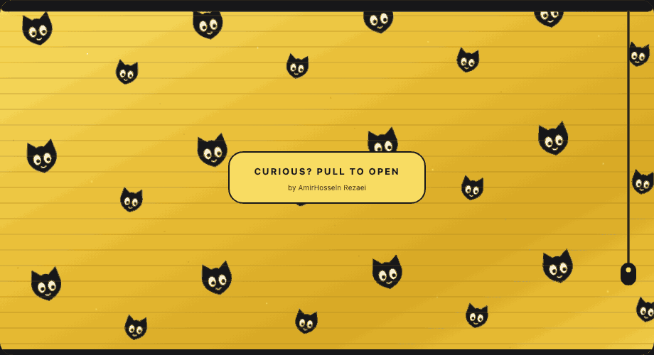

# GitHub Profile Card

Self-hosted animated GitHub profile stats card — dark bento layout, live GraphQL stats, contribution morph, and a curtain intro (**cat** / **Spider-Man** / **Batman**).

<p align="center">
  
</p>

MIT licensed · credit for [AmirHossein Rezaei](https://github.com/DinonowDev) stays on the card even after you fork.

---

## Curtain theme examples

<table>
  <tr><td align="center"><strong>Cat</strong></td></tr>
  <tr><td></td></tr>
  <tr><td align="center"><strong>Spider-Man</strong></td></tr>
  <tr><td></td></tr>
  <tr><td align="center"><strong>Batman</strong></td></tr>
  <tr><td></td></tr>
</table>

---

## Use this on your GitHub profile

### 1. Fork this repository

1. Open [DinonowDev/github-profile-landing](https://github.com/DinonowDev/github-profile-landing)
2. Click **Fork**
3. Name the fork exactly like your GitHub username (`YourUsername/YourUsername`) so it becomes your [profile README](https://docs.github.com/en/account-and-profile/setting-up-and-managing-your-github-profile/customizing-your-profile/managing-your-profile-readme)

If you already have a profile README repo, copy these into it instead:

- `scripts/generate-cards.mjs`
- `.github/workflows/update-stats.yml`
- `assets/` (optional starter files)

### 2. Personalize

Edit `scripts/generate-cards.mjs`:

```js
const USERNAME = process.env.GH_USERNAME || "YourUsername";

const SOCIAL = {
  telegram: { handle: "@you", url: "https://t.me/you" },
  linkedin: { handle: "linkedin/in/you", url: "https://www.linkedin.com/in/you" },
  github: { handle: "github.com/YourUsername", url: "https://github.com/YourUsername" },
};
```

Leave the `DEVELOPER` constant unchanged — that author credit is intentional and hardcoded.

Put this in your profile `README.md`:

```html
<p align="center">
  
</p>
```

### 3. Workflow username

In `.github/workflows/update-stats.yml`, live generation already uses `github.repository_owner` by default. Optionally set an Actions variable `GH_USERNAME` to override it.

CI always runs with `USE_MOCK=0` (real GitHub API data).

### 4. Enable GitHub Actions

1. Fork → **Settings** → **Actions** → **General** → allow workflows / allow write commits
2. Run **Update Profile Stats** once from the **Actions** tab

The card regenerates daily and whenever the generator/workflow files change.

### 5. Curtain theme (optional)

**Settings → Secrets and variables → Actions → Variables**

| Name | Value |
| --- | --- |
| `CARD_THEME` | `cat`, `spiderman`, `batman`, or empty for random |

You can also pick a theme when running the workflow manually.

---

## Metrics

| Metric | Meaning |
| --- | --- |
| **STARS** | Stars on **your** public (non-fork) repos |
| **REPOS** | Your public owned repos |
| **FOLLOWERS / FOLLOWING** | Social counts |
| **CONTRIB REPOS** | Public repos you contributed to that you **do not** own |
| **OSS STARS** | Sum of stars on those contributed-to repos |

---

## Local generate

```bash
# Demo snapshot (default) — irregular mock heatmap, no API needed
node scripts/generate-cards.mjs

# Live data
USE_MOCK=0 GH_USERNAME=YourUsername GITHUB_TOKEN=ghp_xxx CARD_THEME=cat node scripts/generate-cards.mjs
```

Regenerate looping example GIFs (needs Google Chrome + [gifski](https://gif.ski)):

```bash
cargo install gifski   # once
node scripts/render-example-gifs.mjs
```

---

## License

MIT — see [`LICENSE`](./LICENSE).
